# kidskoding

Hello, my name is Anirudh Konidala and
I am a freshmen studying both Computer Science and Education at the University of Illinois Urbana-Champaign!

## Currently working on

## About

I enjoy integrating AI and ML into the field of educational technology, where I actively
create content online to guide many people
in learning the important skill of programming using ML based tutors to
personalize students' learning and help them learn at their own pace

  

## Daily Drivers

### [Skills](https://github.com/kidskoding/kidskoding/blob/master/SKILLS.md)
